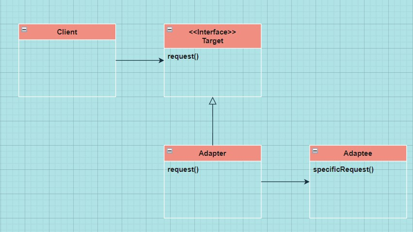

# Chapter 07 Adapter Pattern

> **"분리된 클라이언트는 행복한 클라이언트다!"**

<br>

## Definition
> 특정 클래스 인터페이스를 클라이언트에서 요구하는 다른 인터페이스로 **변환**합니다. **인터페이스가 호환되지 않아 같이 쓸 수 없었던 클래스를 사용할 수 있게 도와줍니다**.

---

## Feature
- Client와 구현된 인터페이스를 분리할 수 있다.
- 변경 내역이 Adapter에 캡슐화되므로 인터페이스가 바뀌더라도 Client를 바꿀 필요가 없다.
- **메소드가 1대1 로 대응되지 않는 상황**에서는, Client가 예외 발생 가능성을 염두에 두고 있어야 하기 때문에, Adapter를 **완벽하게** 적용할 수 **없다**.

---

## Class Diagram (객체 Adapter)



- **Client**
    - Target Interface에 맞게 구현
- **Adapter**
    - Target Interface를 구현
    - Adaptee 인스턴스로 구성
- **Adaptee**
    - Adaptee Interface를 구현
    - 모든 요청은 Adaptee에 위임

<br>

- **Client**는 <u>**인터페이스에 연결**</u>되어 있으며, <u>**Adaptee와 분리**</u>되어 있다.
- **Adaptee**를 새로 바뀐 인터페이스로 감쌀 때는 **객체 구성**을 사용한다. (**Adaptee**의 모든 subclass에 **Adapter**가 있다.)
- 서로 다른 백엔드 클래스로 변환시키는 여러 **Adapter**를 사용할 수도 있다.
    
<br>
    
- **Client에서 Adapter를 사용하는 방법**
    1. **Client에서 Target Interface로 메소드를 호출해서 Adapter에 요청을 보낸다**.
    2. **Adapter는 Adapter Interface로 그 요청을 Adaptee에 관한 메소드 호출로 변환한다**.
    3. Client는 호출 결과를 받긴 하지만 중간에 Adapter가 있다는 사실을 모른다.

---

## ```Adapter```
- **Client로부터 요청을 받아서** 새로운 업체에서 제공하는 클래스를 **Client가 받아들일 수 있는 형태의 요청으로 변환**해주는 <u>**중개인 역할**</u>

<br>

- Sample Code

```java
public interface Duck{
    public void quack();
    public void fly();
}

public class MallardDuck implements Duck{
    public void quack(){
        System.out.println("꽥");
    }

    public void fly(){
        System.out.println("날고 있어요!!");
    }
}

// 새로운 interface: Turkey
public interface Turkey{
    public void gobble();
    public void fly();
}

// Turkey 구상 클래스
public class WildTurkey implements Turkey{
    public void gobble(){
        System.out.println("골골");
    }

    public void fly(){
        System.out.println("짧은 거리를 날고 있어요!");
    }
}

// Client에서 원하는 인터페이스를 구현해야 한다
public class TurkeyAdapter implements Duck{
    Turkey turkey;

    // 기존 형식 개체의 레퍼런스
    // 생성자에서 레퍼런스를 받아오는 작업을 처리
    public TurkeyAdapter(Turkey turkey){
        this.turkey = turkey;
    }

    // quack()과 fly()는 인터페이스에 들어있는 메소드!
    public void quack(){
        turkey.gobble();
    }

    public void fly(){
        for(int i=0; i<5; i++){
            turkey.fly();
        }
    }
}
```

<br>

- Sample Test Code
```java
public class DuckTestDrive{
    public static void main(String[] args){
        Duck duck = new MallardDuck();

        Turkey turkey = new WildTurkey();
        // Turkey 객체를 TurkeyAdapter로 감싸서 Duck 객체처럼 보이게 한다.
        Duck turkeyAdapter = new TurkeyAdapter(turkey);

        ...

        testDuck(turkeyAdapter);
    }

    static void testDuck(Duck duck){
        duck.quack();
        duck.fly();
    }
}
```

---

## Usecase

- ```JAVA```에서는 호환성이 없는 인터페이스 객체를 올바른 인터페이스 객체로 감싸서 Adapter 패턴을 구현할 수 있다.

    - **Enumeration**을 **Iterator**로 변환해주는 Adapter 생성
        - **Target Interface**: ```Iterator```
        - **Adaptee Interface**: ```Enumeration```
    - **Issue**: ```Iterator```의 ```remove()```에 대응되는 ```Enumeration```의 메소드가 없음

```java
public class EnumerationIterator implements Iterator<Object>{
    Enumeration<?> enumeration;

    public EnumerationIterator(Enumeration<?> enumeration){
        this.enumeration = enumeration;
    }

    public boolean hasNext(){
        return enumeration.hasMoreElements();
    }

    public Object next(){
        return enumeration.nextElement();
    }

    public void remove(){
        throw new UnsupportedOperationException();
    }
}
```

<br>

- **Iterator**를 **Enumeration**로 변환해주는 Adapter 생성

```java
public class IteratorEnumeration implements Enumeration<Object>{
    Iterator<?> iterator;

    public IteratorEnumeration(Iterator<?> iterator){
        this.iterator = iterator;
    }

    public boolean hasMoreElements(){
        return iterator.hasNext();
    }

    public Object nextElement(){
        return iterator.next();
    }
}
```

---

## Decorator Pattern vs Adapter Pattern

- **Decorator Pattern**: "행동과 책임을 **확장**"
    - 기존 코드를 고치지 않아도 클래스에 새로운 행동을 추가할 수 있음
    - 감싸고 있는 객체의 행동과 책임을 확장
- **Adapter Pattern**: "인터페이스를 **변환**"
    - 기존 코드를 고치지 않고도 Client들은 새로운 라이브러리를 쓸 수 있음
    - 감싸고 있는 인터페이스를 변환