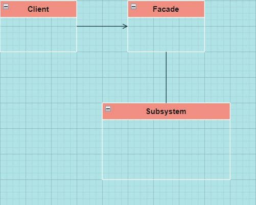

# Chapter 07 Facade Pattern

> **"인터페이스를 단순하게 만들고 Client와 Subsystem을 분리!"**

---

## Definition

> **Subsystem에 있는 일련의 인터페이스를 통합 인터페이스로 묶어 주고, 고수준 인터페이스도 정의하므로 Subsystem을 더 편리하게 사용할 수 있다.**

---

## Feature

- 하나 이상의 클래스 인터페이스를 **Facade Class** 로 덮어준다.
- **Facade Pattern을 사용하려면** 어떤 Subsystem에 속한 일련의 복잡한 클래스를 단순하게 바꿔서 **통합한 클래스를 만들어야 한다**.
- 복잡한 추상화가 **필요 없다**.

---

## 최소 지식 원칙

> **"객체 사이의 상호작용은 될 수 있으면 아주 가까운 객체 사이에서만 허용하는 편이 좋다."**

<br>

#### 최소 지식 원칙을 준수하기 위한 가이드라인
- 객체 자체
- 메소드에 매개변수로 전달된 객체
- 메소드를 생성하거나 인스턴스를 만든 객체
- 객체에 속하는 <u>구성 요소(인스턴스 변수에 의해 참조되는 객체)</u>

<br>

#### Feature
- **객체 사이의 의존성을 줄일 수 있으며** 소프트웨어 관리가 더 편해진다. 
- 메소드 호출을 처리하는 **Wrapper Class가 많아진다면** 시스템이 복잡해지고, 개발 시간도 늘어나고, 성능도 떨어진다.

<br>

#### Sample Code
- 최소 지식 원칙을 **따르지 않은** 경우
```java
public float getTemp(){
    Thermometer thermometer = station.getThermometer();
    return thermometer.getTemperature();
}
```
- 최소 지식 원칙을 **따르는** 경우
    - ```thermometer```에게 요청을 전달하는 메소드를 ```station``` 클래스에 추가함
```java
public float getTemp(){
    return station.getTemperature();
}
```

---

## Class Diagram



## Sample Code

- **Facade Class**
    - **Client 대신 모든 Subsystem 구성 요소를 관리**해주기 때문에 **Client는 단순하면서도 유연**해질 수 있다.
    - **Subsystem에서도 최소 지식 원칙을 지키는 것이 좋다**.

```java
public class HomeTheaterFacade{
    // 서브시스템의 모든 구성 요소를 인스턴스 변수 형태로 저장
    Amplifier amp;
    Tuner tuner;
    StreamingPlayer player;
    Projector projector;
    TheaterLights lights;
    Screen screen;
    PopcornPopper popper;

    // Facade의 생성자에는 서브시스템 구성 요소의 레퍼런스가 전달
    // Facade는 각 레퍼런스를 인스턴스 변수에 저장
    public HomeTheaterFacade(Amplifier amp, Tuner tuner ...){
        this.amp = amp;
        this.tuner = tuner;
        ...
    }

    // 기타 메소드
}
```

<br>

- **단순화된 Interface**
    - 복잡한 일을 하나의 메소드로 간단하게 처리할 수 있다.
    - **각 작업은 Subsystem에 들어있는 구성 요소에게 위임**된다.

```java
public void watchMovie(String movie){
    ...
}

public void endMovie(){
    ...
}
```

---

## 장점

- **Client와 Subsystem을 분리**할 수 있다.
    - Client와 Subsystem이 서로 긴밀하게 연결되지 않아도 된다.
    - 인터페이스가 크게 달라질 경우, Client를 Facade로 만들었다면 Client 코드는 고칠 필요 없이 Facade만 바꾸면 된다.
                                                               
- **Facade Class**는 Subsystem Class를 캡슐화하지 않고, **Subsystem의 기능을 사용할 수 있는 간단한 인터페이스를 제공**할 뿐이다. 이 때, 간단한 기능을 알아서 추가할 수 있다.
    - Client에서 특정 인터페이스가 필요하다면 Subsystem Class를 그냥 사용하면 된다.

- 특정 Subsystem에 대해 만들 수 있는 Facade의 개수에는 **제한이 없다**.

---

## Adapter vs Facade

- **공통점**: 여러 개의 클래스를 감쌀 수 있다.
- **차이점**: 
    - **Adapter**: 하나의 인터페이스를 다른 인터페이스로 변환한다.
    - **Facade**: 인터페이스를 간단하게 변경한다.

---

## Usecase

- **Server**
    - Multi-layer 웹 애플리케이션에서 Service 계층과 Presentation 계층 사이 

- **Refactoring**
    - Client가 신경쓰지 않아야 할 코드를 Facade 뒤로 숨길 수 있어 더 사용하기 쉬운 인터페이스를 만들 수 있다.

- 다른 디자인 패턴과 자주 합쳐져서 쓰인다.

## References
- [JavaScript Facade](https://www.dofactory.com/javascript/design-patterns/facade)