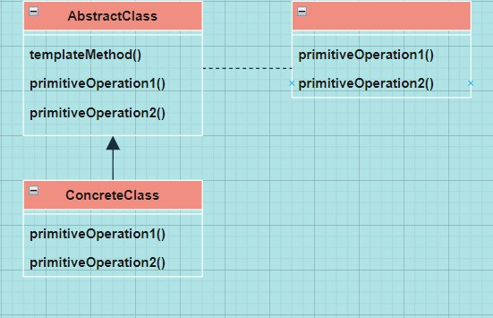

# Chapter 08 Template Method Pattern

## Definition 
> **알고리즘의 골격을 정의한다**

---

## Class Diagram



- ```abstract``` 메소드로 선언된 단계(메소드)들이 Template Method에서 활용된다.
- ```ConcreteClass```는 여러 개가 있을 수 있다. 각 클래스는 Template Method에서 요구하는 모든 단계를 제공해야 한다.
- Template Method는 알고리즘을 구현할 때 ```primitiveOperation```을 활용한다. 알고리즘은 이 단계들의 구체적인 구현으로부터 분리되어 있습니다.

<br>

### Class Diagram의 ```AbstractClass```
```java
abstract class AbstractClass{
    final void templateMethod(){
        primitiveOperation1();
        primitiveOperation2();
        concreteOperaton();
        hook();
    }

    abstract void primitiveOperation1();

    abstract void primitiveOperation2();

    void concreteOperation(){
        // concreteOperation() 메소드 코드
    }

    void hook() {}
}
```
- 서브클래스가 알고리즘의 각 단계를 마음대로 건들지 못하게 ```final```로 선언한다.
- ```primitiveOperation1()```, ```primitiveOperation2()```: 구상 서브클래스에서 **반드시, 모두** 구현한다.
- ```concreteOperation()```: 추상 클래스 내 구상 메소드에서 구현한다. 서브클래스에서 오버라이드 할 수 없다. Template Method에서 직접 호출할 수도 있고, 서브클래스에서 호출해서 사용할 수도 있다.
- 추상 메소드가 너무 많아지면 서브클래스에서 일일이 추상 메소드를 모두 구현해야 해서 좋지 않고, 너무 적으면 유연성이 떨어진다는 단점이 있다.
- **모든 단계가 필수는 아니다**.
    - 필수가 아닌 부분을 후크로 구현하면 된다.

<br>

### Hook
> **추상 클래스에서 선언되지만 기본적인 내용만 구현되어 있거나 아무 코드도 들어있지 않은 메소드**

- 서브클래스는 다양한 위치에서 알고리즘에 끼어들 수 있다.
    - Hook가 있으면 그 메소드를 오버라이드 할 수도 있고, 그렇지 않아도 추상 클래스에서 제공한 코드가 실행된다.

- Hook을 사용하려면 서브클래스에서 Hook를 오버라이드해야 한다.
    - Hook를 오버라이드해서 원하는 기능을 넣는다.

```java
public abstract class CaffeineBeverageWithHook{
    final void prepareRecipe(){
        ...
        if(customerWantsCondiments()){
            addCondiments();
        }

        ...

        // Hook인 이유
        // 1. true만 리턴할 뿐 다른 작업은 하지 않음
        // 2. 서브클래스에서 필요할 때 오버라이드할 수 있는 메소드
        boolean customerWantsCondiments(){
            return true;
        }
    }
}
```

- Template을 만들 때 추상 메소드 vs Hook
    - 추상 메소드: 서브클래스가 알고리즘의 특정 단계를 제공해야만 한다면 사용
    - Hook: 서브클래스에서 필요할 때 후크를 구현할 수도 있지만, 꼭 구현해야 하는 것은 아니다.

- Hook의 용도
    - 알고리즘에서 필수적이지 않은 부분을 서브클래스에서 구현하도록 만들고 싶을 때
    - Template Method에서 앞으로 일어날 일이나 막 일어난 일에 서브클래스가 반응할 수 있도록 기회를 제공하는 용도
    - 서브클래스가 추상 클래스에서 진행되는 작업을 처리할지 말지 결정하게 하는 기능을 부여하는 용도


---

## Feature

### Template Method
> **"Template Method는 <u>알고리즘의 각 단계를 정의</u>하며, <u>서브클래스에서 일부 단계를 구현하거나 재정의 할 수 있도록 유도</u>한다."**

- **Template == 일련의 단계로 알고리즘을 정의한 Method**
    - 하나 이상의 단계가 추상 메소드로 정의되며, 추상 메소드는 서브클래스에서 구현한다.

```java
public abstract class CaffeineBeverage{
    final void prepareRecipe(){
        boilWater();
        brew();
        pourInCup();
        addCondiments();
    }

    abstract void brew();

    abstract void addCondiments();

    void boilWater(){
        ... 
    }

    void pourInCup(){
        ...
    }
}
```
- **Template Method**: ```prepareRecipe()```
    - 어떤 알고리즘의 Template(틀) 역할을 하는 메소드
    - Template 내에서 알고리즘의 각 단계는 메소드로 표현
    - 각 단계는 ```CaffeineBeverage``` 클래스나 서브클래스에서 처리된다.
- 서브클래스에서 구현해야 하는 메소드는 ```abstract```로 선언해야 한다.

---

## 장점
- 각 클래스가 각자 수행해야 하는 알고리즘을 Template Method에서 독점으로 처리할 수 있다.
- 서브클래스에서 코드를 재사용 할 수 있다.
- 알고리즘이 한 곳에 모여 있으므로 여러 곳이 아닌 한 곳만 고치면 된다. 따라서 일부 구현만 서브클래스에 집중한다.
- 서브클래스를 쉽게 추가할 수 있는 프레임워크를 제공한다.

---

## 할리우드 원칙
> **"먼저 연락하지 마세요. 제가 먼저 연락 드리겠습니다."**

-  <u>**의존성 부패(Dependency Rot)**</u>를 방지할 수 있다.
    - 저수준 구성 요소와 고수준 구성 요소가 서로 의존하지 않게 할 수 있다.
    - 저수준 구성 요소가 시스템에 접속(Computation)할 수는 있지만 언제, 어떻게 그 구성 요소를 사용할지는 고수준 구성 요소가 결정한다.
    - 저수준 구성 요소는 절대 고수준 구성 요소를 직접 호출할 수 없다. (고수준 구성 요소에 있는 메소드를 호출할 수 있으나, 순환 의존성이 생기지 않도록 해야한다.)

---

## 할리우드 원칙과 Template Method 패턴

- ```CaffeineBeverage``` 클래스의 Client는 구상 클래스가 아닌 ```CaffeineBeverage```에 추상화되어 있는 부분에 의존하여 전체 시스템의 의존성을 줄일 수 있다.
- 서브클래스는 자질구레한 메소드 구현을 제공하는 용도로만 쓰인다.

## 할리우드 원칙과 의존성 뒤집기 원칙

- 공통점
    - 객체를 분리하는 것이 목표
- 차이점
    - 의존성 뒤집기 원칙: 구상 클래스 사용을 줄이고 추상화된 것을 사용해야 한다는 원칙
    - 할리우드 원칙: 저수준 구성 요소가 Computation에 참여하면서도 저수준 구성 요소와 고수준 계층 간 의존을 없애도록 프레임워크나 구성 요소를 구축하는 기법
    - '의존성을 피하는 방법'에 대해서 의존성 뒤집기 원칙이 더 강하다.

---

## Usecase

- **Java API**
    - ```Arrays.sort()```

    ```java
    ...

    public static void mergeSort(Object src[], Object dest[], int low, int high, int off){
        ...

        for(int i=low; i<high; i++){
            for(int j=i; j>low && ((Comparable)dest[j-1]).compareTo((Comparable)dest[j])>0; j--)
            {
                swap(dest, i, j);
            }
        }

        ...
    }
    ```

    - ```mergeSort()```: Template Method
    - ```compareTo()```를 구현해야 Template Method가 완성된다.
        - 단, ```sort()```가 특정 슈퍼클래스에 정의된 것이 아니므로 ```compareTo()```를 구현했는지를 알 수 없다.
        - 그래서 ```Comparable```이라는 인터페이스를 도입한다.
        - 서브클래스를 만들어서 쓰는 대신 ```Comparable``` 인터페이스를 구현해야 한다.

<br>

- **Framework** 
    - 프레임워크로 작업이 처리되는 방식을 제어하면서도 프레임워크에서 처리하는 알고리즘의 각 단계를 사용자가 마음대로 지정할 수 있다.
