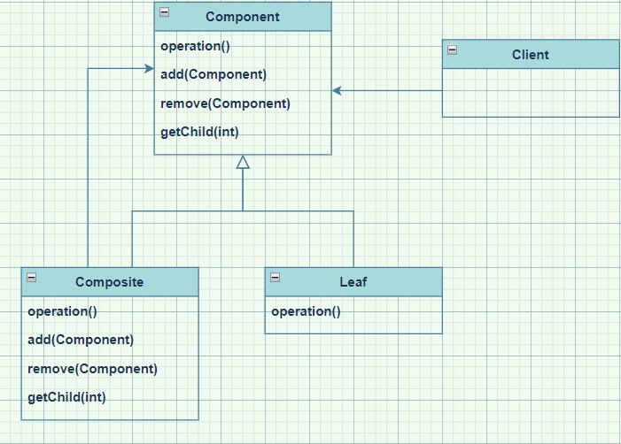

# Chapter 09 Composite Pattern

---

## Definition
> **"객체를 트리 구조로 구성해서 부분-전체 계층구조를 구현"**

- **부분-전체 계층 구조(part-whole hierarchy)**
: 부분들이 계층을 이루고 있지만 모든 부분을 묶어서 전체로 다룰 수 있는 구조

---

## Feature

> **"Client를 단순화시킬 수 있다."**

<br>

- **Client에서 개별 객체와 복합 객체를 똑같은 방법으로 다룰 수 있다.**
    - 메뉴, 서브메뉴, 서브서브메뉴로 구성된 트리구조가 있다고 하면 각각이 모두 복합 객체가 될 수 있다.
    - 개별 객체와 복합 객체에 똑같은 메소드를 호출한다.

- 메소드 하나만 호출하면 전체 구조를 대상으로 반복 작업을 처리할 수 있다.

<br>

- ```Component``` 인터페이스에 자식들을 관리하는 기능과 잎으로써의 기능을 전부 넣는다.

- **<u>단일 역할 원칙을 깨는 대신 투명성을 확보</u>**
    - Client가 복합 객체와 잎을 똑같은 방식으로 처리할 수 있도록 만들 수 있어, 어떤 원소가 복합 객체인지 잎인지가 Client에게는 투명하게 보인다.
    - **모든 객체의 인터페이스가 같아야 한다.**

<br>

- **고려 사항**
    - 의미 없는 메소드들을 처리하는 방법
        - 아무 일도 하지 않거나 ```NULL```/```False```를 상황에 맞게 리턴
        - 예외 처리
    - Client가 어떤 형식의 객체를 다룰지 미리 알 수 없을 때, 어떤 메소드를 호출하면 안 되는지를 알 수 있는 방법
        - 메소드 구조를 잘 조절해서 기본 구현으로 그럴듯한 행동을 하게 만들기
        - 메소드를 호출하기 전에 객체의 형식을 매번 확인해서 클라이언트가 서로 다른 객체에 서로 다른 인터페이스를 요구
    - 자식의 순서
    - **Cache**: 복합 구조가 너무 복잡하거나, 복합 객체 전체를 도는 데 너무 많은 자원이 필요하다면 복합 노드를 캐싱

<br>

>**"상황에 따라 디자인 원칙을 적절하게 사용해야 한다."**

---

## Class Diagram



- **Client** (Waitress)
    - ```Component``` 인터페이스를 사용해서 복합 객체 내의 객체들을 조작할 수 있다.

- **Component** (MenuComponent)
    - **복합 객체 내에 들어있는 모든 객체의 인터페이스를 정의**한다.

- **Composite** (Menu)
    - ```Leaf```와 관련된 기능도 구현해야 한다. 그런 기능들이 복합 객체에게 쓸모가 없다면 예외를 던지는 방법으로 처리해도 된다.
    - 자식이 있는 구성 요소의 행동을 정의하고 자식 구성 요소를 저장하는 역할을 맡는다.

- **Leaf** (MenuItem)
    - ```Leaf```안에 들어있는 원소의 행동을 정의한다. ```Composite```에서 지원하는 기능을 구현하면 된다.
