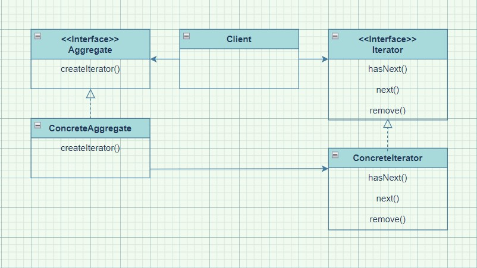

# Chapter 09 Iterator Pattern
>**"반복을 캡슐화하라!"**

---

## Definition
> **Collection의 구현 방법을 노출하지 않으면서 집합체 내의 모든 항목에 접근하는 방법을 제공**

---

## 단일 역할 원칙

> **"어떤 클래스가 바뀌는 이유는 하나뿐이어야 한다."
(하나의 역할은 하나의 클래스에서만 맡아야 한다.)**

- **어떤 클래스에서 맡고 있는 모든 역할은 나중에 코드 변화를 불러올 수 있다.**
    - **클래스**에서 **집합체 관리** 외에 **반복자 메소드를 처리**하는 역할을 하면 그 클래스가 바뀔 수도 있다.

---

## Feature

> **컬렉션 == 집합체(aggregate) == 객체를 모아 놓은 것**

- 외부에서 **집합체 내부의 구현 방법을 모르는 상태에서** 그 안에 있는 모든 항목을 대상으로 반복 작업을 수행할 수 있다.

- 외부에서는 인터페이스(반복자)만 알면 된다.

- 컬렉션 객체 안에 들어있는 항목에 접근하는 방식이 통일되어 있다.
    - 단, 반복자에는 특별한 순서가 정해져 있지 않기 때문에 접근 순서는 컬렉션의 특성 및 구현과 연관되어 있다.

- **Internal** 반복자 vs **External** 반복자
    - **Internal**: **반복자 자신**이 반복작업을 제어
    - **External**: **클라이언트**가 반복작업을 제어
    - **유연성**은 **External이 더 높다**.

<br>

#### Iterator를 적용하면 얻을 수 있는 효과
- 컬렉션의 종류에 관계없이 ```iterator```를 지원하기만 하면 모든 집합체에 사용할 수 있는 다형적인 코드를 만들 수 있다.
- **집합체에 있는 모든 항목에 일일이 접근하는 작업을 컬렉션 객체(집합체)가 아닌 Iterator 객체가 맡게 된다**.
    - 집합체의 인터페이스와 구현이 간단해진다.
    - 집합체는 반복 작업에서 손을 떼고 객체 컬렉션 관리에만 전념할 수 있다.
- 반복자를 구현한 코드를 컬렉션 밖으로 끄집어낼 수 있다. (**반복 작업을 캡슐화했다고 할 수 있다.**)

> **<u>컬렉션과 반복자를 사용하면 모든 컬렉션 객체에서 자신을 대상으로 하는 반복자를 리턴할 수 있다.</u>**

---

## Class Diagram



- **Client**
    - **ConcreteAggregate**에 의존하는 문제를 해결할 수 있다.
<br>

- **Aggregate**
    - 공통된 인터페이스가 있으면, Client와 객체 컬렉션의 구현이 분리되기 때문에 Client는 매우 편리하게 작업을 처리할 수 있다.
```java
public interface Menu{
    public Iterator<MenuItem> createIterator();
}
```

<br>

> **"구현보다는 인터페이스에 맞춰서 프로그래밍한다."**

- **Iterator** 인터페이스(**java.util.Iterator**)
    - 모든 반복자가 구현해야 하는 인터페이스를 제공한다.
    - 컬렉션에 들어있는 원소에 돌아가면서 접근할 수 있게 해주는 메소드를 제공한다.
    - **Iterator** 인터페이스만 있으면 모든 종류의 객체 컬렉션에 반복자를 구현할 수 있다.
    - ```remove()```를 제공하고 싶지 않다면 ```java.lang.UnsupportedOperationException```을 던진다.
    - 컬렉션에 동시에 접근하는 멀티스레드 코드를 디자인할 때는 매우 조심해야 한다.
    - **집합체의 ```Iterator``` 인터페이스에 다른 기능을 추가하고 싶다면 ```Iterator``` 인터페이스를 확장해서 쓰면 된다.**
```java
public interface Iterator{
    boolean hasNext();
    MenuItem next();
}
```
<br>

- **ConcreteAggregate**
    - 객체 컬렉션이 들어있으며, 그 안에 들어있는 컬렉션을 Iterator로 리턴하는 메소드를 구현한다.

```java
public class CafeMenu implements Menu{
    Map<String, MenuItem> menuItems = new HashMap<String, MenuItem>();

    public CafeMenu(){
        // 생성자 코드
    }

    public void addItem(String name, String description, boolean vegetarian, double price){
        ...
    }

    public Iterator<MenuItem> createIterator(){
        return menuItems.values().iterator();
    }
}
```
- ```createIterator()```
    - HashMap 전체를 대상으로 반복자를 리턴하는 것이 아니라 **값(MenuItem)** 을 대상으로 반복자를 리턴한다.

<br>

- **ConcreteIterator**는 반복 작업 중에 현재 위치를 관리하는 일을 맡고 있다.
```java
import java.util.Iterator;

public class DinerMenuIterator implements Iterator{
    MenuItem[] items;
    int position = 0;

    public DinerMenuIterator(MenuItem[] items){
        this.items = items;
    }

    public MenuItem next(){
        MenuItem menuItem = items[position];
        position = position + 1;
        return menuItem;
    }

    public boolean hasNext(){
        if(position >= items.length || items[position] == null){
            return false;
        } else {
            return true;
        }
    }

    public void remove(){
        throw new UnsupportedOperationException("...");
    }
}
```
<br>

- 모든 **ConcreteAggregate**는 그 안에 있는 객체 컬렉션을 대상으로 돌아가면서 반복 작업을 처리할 수 있게 해주는 **ConcreteIterator**의 인스턴스를 만들 수 있어야 한다.

```java
public class Waitress{
    List<Menu> menus;

    public Waitress(List<Menu> menus){
        this.menus = menus;
    }

    public void printMenu(){
        Iterator<Menu> menuIterator = menus.iterator();
        while(menuIterator.hasNext()){
            Menu menu = menuIterator.next();
            printMenu(menu.createIterator());
        }
    }

    void printMenu(Iterator<MenuItem> iterator){
        ...
    }
}
```

- 오버로드된 ```printMenu()```는 반복자를 써서 모든 메뉴 항목에 접근해서 그 내용을 출력한다.

---

## Iterable 인터페이스

- ```Java```의 모든 컬렉션 유형에서 ```Iterable``` 인터페이스를 구현한다.
- ```iterator()```,```forEach()```,```spliterator()```
    - ```iterator()```: ```Iterator``` 인터페이스를 구현하고, 반복자를 리턴한다.
    - ```forEach()```: 컬렉션에 있는 항목을 대상으로 반복 작업을 수행하는 방법을 제공한다.
    - ```spliterator()```: 컬렉션을 대상으로 반복 작업을 할 때 더 발전된 기능을 제공한다.
