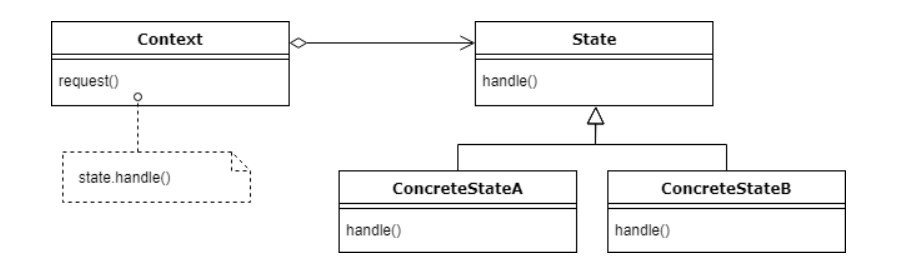

# Chapter 10 State Pattern

## Definition
> **객체의 내부 상태가 바뀜에 따라서 객체의 행동을 바꿀 수 있다. (클라이언트의 관점에서) 마치 객체의 클래스가 바뀌는 것과 같은 결과를 얻을 수 있다.**

---

## Feature

>**"바뀌는 부분은 캡슐화한다."**
- 각 상태의 행동을 별개의 클래스로 캡슐화한다.

<br>

>**"구성을 활용한다."**
- 상태별 행동을 별도의 클래스에 넣어 두고 모든 상태에서 각각 자기가 할 일을 구현하도록 한다.
- 어떤 행동이 호출되면 **현재 상태 객체에서** 필요한 작업을 처리한다.(**행동을 위임**한다.)
- 내부 상태가 바뀔 때 행동이 달라지게 된다.

<br>

---

## Class Diagram



- **Context**
    - 상태를 관리하는 일을 한다.
    - ```Context```의 ```request()```가 호출되면 그 작업은 상태 객체에게 맡겨진다.
    - 상태 전환이 고정되어 있으면 상태 전환 흐름을 결정하는 코드를 ```Context```에 넣어도 되지만, 상태 전환이 동적으로 결정된다면 상태 클래스 내에서 처리하는 것이 좋다.

    ```java
    public class GumballMachine{
        State AState;
        State Bstate;
        State CState;
        State DState;

        State state = AState;
        int count = 0;
    }
    ```

    - 상태 객체를 생성하고 대입하는 작업은 생성자에서 처리한다.
    - ```state```는 정수가 아니라 상태 객체에 저장된다.
<br>
- **State**
    - 모든 상태 클래스에서 구현할 인터페이스
    - 인터페이스 안의 메소드는 일어날 수 있는 모든 행동에 직접적으로 대응한다.
    - 각 상태를 직접 클래스에 대응시킨다.
<br>
- **ConcreteState**
    - ```Context```로부터 전달된 요청을 자기 나름의 방식으로 구현해서 처리한다.
    - ```Context```에서 상태를 바꿀 때마다 행동도 바뀌게 된다.
    - 원하는 만큼 만들 수 있다.
<br>
- **Client**
    - 상태 객체와 직접 연락할 수 없다.
    - ```Context```의 상태를 직접 바꿀 수 없다.

---

## 장점

- 새로운 상태를 추가하려면 그냥 클래스를 추가하고 상태 전환과 관련된 코드만 고치면 된다.

- **OCP**
    - 각 상태는 변경에 닫혀 있고, GumballMachine 클래스는 새로운 상태 클래스를 추가하는 확장에는 열려 있다.

- **FSM Diagram에 가까우면서, 이해하기 좋은 코드 베이스와 클래스 구조를 만들 수 있다.**

---

## 단점

- 상태의 개수가 적다면 불필요한 코드들이 많아질 수 있다.
- 런타임 중 상태가 바뀐다면, 상태 클래스의 수가 예고없이 많아질 수 있다.
- 상태 전환 코드를 상태 클래스에 넣으면 상태 클래스들 간 의존성이 강하다.

---

## 상태 패턴 vs 전략 패턴

- **상태 패턴**
    - 상태 객체에 일련의 행동을 캡슐화한다.
    - 클라이언트는 상태 객체를 몰라도 된다.

- **전략 패턴**
    - 클라이언트가 ```Context```객체에게 어떤 전략 객체를 사용할지를 지정해준다.
    - 주로 실행 시에 전략 객체를 변경할 수 있는 유연성을 제공한다.(구성)
    - 서브클래스를 만드는 방법을 대신해서 유연성을 극대화한다.

---

## Usecase

---

## References

- [State Method in Python](https://www.geeksforgeeks.org/state-method-python-design-patterns/)
- [State Pattern](https://gngsn.tistory.com/141)
- [State Management Pattern in Vuex](https://vuex.vuejs.org/#what-is-a-state-management-pattern)
- [JavaScript State Machine](https://github.com/jakesgordon/javascript-state-machine)