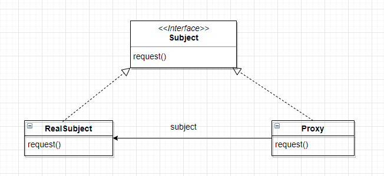
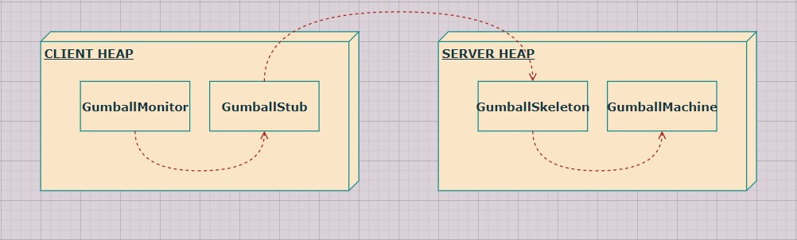
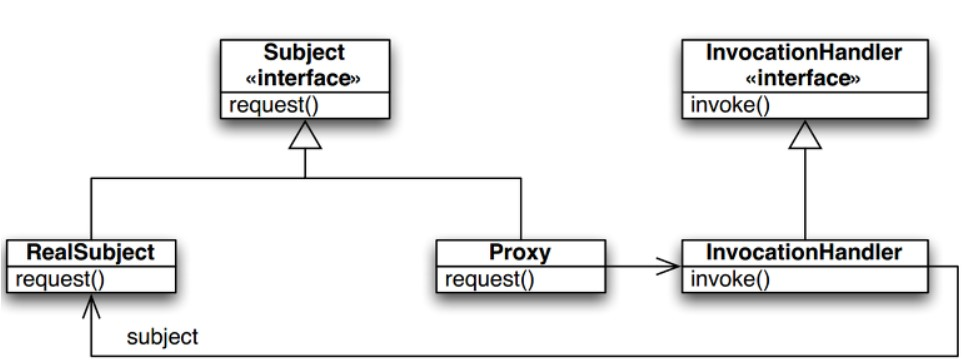

# Chapter 11 Proxy Pattern

---

## Definition
>**특정 객체로의 접근을 제어하는 <u>대리인</u>(특정 객체를 대변하는 객체)을 제공한다.**

---

## Feature

- **프록시에서 접근을 제어하는 방법**
    - **원격 프록시**를 써서 **원격 객체로의** 접근을 제어할 수 있다.
    - **가상 프록시**를 써서 **생성하기 힘든 자원으로의** 접근을 제어할 수 있다.
    - **보호 프록시**를 써서 **접근 권한이 필요한 자원으로의** 접근을 제어할 수 있다.

- 클라이언트가 실제 객체의 메소드를 호출하면, 그 호출을 중간에 가로챈다.

- **클라이언트에서 진짜 객체가 아닌 프록시를 사용하도록 만드는 방법**
    - 진짜 객체의 인스턴스를 생성해서 리턴하는 팩토리 사용
    - 팩토리 메소드 내에서 진행되기 때문에 객체를 프록시로 감싼 다음에 리턴할 수 있다.

---

## Class Diagram



- ```Subject```
    - 어떤 클라이언트에서든 프록시를 주제와 똑같은 식으로 다룰 수 있다.

- ```RealSubject```
    - 진짜 작업을 대부분 처리하는 객체
    - ```Proxy```는 <u>이 객체로의 접근을 제어하는 객체</u>

- ```Proxy```
    - 진짜 작업을 처리하는 객체(**```RealSubject```**)의 레퍼런스가 들어있다.
        - **```RealSubject```** 를 생성하거나 제거하는 역할을 책임지는 경우도 있다.
    - 진짜 객체가 필요하면 그 레퍼런스를 사용해서 요청을 전달한다.
    - ```RealSubject```의 인스턴스를 생성하거나, 그 객체의 생성 과정에 관여하는 경우가 많다.

---

## 원격 프록시

> **원격 객체**의 **로컬 대변자** 역할

- **원격 객체**: 다른 주소 공간에서 돌아가고 있는 객체
- **로컬 대변자**: 로컬 대변자의 어떤 메소드를 호출하면, 다른 원격 객체에게 그 메소드 호출을 전달해 주는 객체

<br>

### Feature

- <u>클라이언트 객체</u>는 원격 객체의 메소드 호출을 하는 것처럼 행동하지만, <u>실제로는 로컬 힙에 들어있는 **프록시 객체**의 메소드를 호출</u>
- 네트워크 통신과 관련된 저수준 작업은 **프록시 객체**에서 처리

<br>

- **How it works?**
    1. 메소드 호출을 받아들이고, 네트워크로 그 호출을 전달
    2. 원격 객체에 있는 동일한 메소드를 호출
    3. 메소드 실행이 끝나면 그 결과가 네트워크로 다시 Client에게 전달
- **```RMI(Remote Method Invocation)```**
    - 원격 JVM에 있는 객체를 찾아서 그 메소드를 호출할 수 있다.

<br>



- ```GumballMonitor```
    - 프록시를 활용해서 멀리 떨어져 있는 뽑기 기계와 데이터를 주고 받는 모니터링 코드
- ```GumballStub```
    - 클라이언트 보조 객체
    - 원격 ```GumballMachine```의 프록시
- ```GumballSkeleton```
    - 서비스 보조 객체
    - 원격 호출을 받아서 서버에서 필요로 하는 작업을 수행
- ```GumballMachine```
    - 원격 서비스 역할
    - 원격 인터페이스를 클라이언트에서 쓸 수 있도록 공개

<br>

### Code

> ```GumballMachine``` 클래스를 클라이언트로부터 전달된 원격 요청을 처리하도록 바꾸기 (**서비스를 구현한 클래스로 만들기**)

<br>

1. ```GumballMachine```의 <u>원격 인터페이스</u>를 만든다. (이 인터페이스를 원격 클라이언트에서 호출할 수 있는 메소드를 정의한다.)
```java
import java.rmi.*;

public interface GumballMachineRemote extends Remote{
    public int getCount() throws RemoteException;
    public String getLocation() throws RemoteException;
    public State getState() throws RemoteException;
}
```
- 모든 리턴 형식은 원시 형식 또는 Serializable

<br>

2. 인터페이스의 모든 리턴 형식을 직렬화할 수 있는지 확인한다.
```java
import java.io.*;

public interface State extends Serializable{
    ...
}

...

public class NoQuarterState implements State{
    private static final long serialVersionUID = 2L;
    transient GumballMachine gumballMachine;
    ...
}
```
- 아무 메소드도 없는 ```Serializable``` 인터페이스를 확장하면, ```State```의 서브클래스를 직렬화해서 네트워크로 전송할 수 있다.
- 단, ```State``` 객체가 전송될 때 ```GumballMachine``` 클래스도 전부 직렬화해서 같이 보내는 일은 별로 바람직하지 않다.
- ```State```를 구현하는 모든 클래스에서 ```GumballMachine``` 인스턴스 변수를 선언하는 부분에 ```transient```를 추가하면, JVM에서는 그 필드를 직렬화하지 않는다.
- 단, 객체를 직렬화해서 전송받은 후에 이 필드를 호출하면 안 좋은 일이 생길 수 있다.

<br>

3. 구상 클래스에서 인터페이스를 구현한다.
```java
import java.rmi.*;
import java.rmi.server.*;

public class GumballMachine extends UnicastRemoteObject implements GumballMachineRemote{
    private static final long serialVersionUID = 2L;
    // 기타 인스턴스 변수

    public GumballMachine(String location, int numberGumballs) throws RemoteException{
        // 생성자 코드
    }
}
```

<br>

4. 서비스 요청을 받아서 처리하도록 만든다.
- 클라이언트가 찾을 수 있게 뽑기 기계를 RMI 레지스트리에 등록
```java
public class GumballMachineTestDrive{
    public static void main(String[] args){
        GumballMachineRemote gumballMachine = null;
        int count;

        ...

        try{
            count = Integer.parseInt(args[1]);

            gumballMachine = new GumballMachine(args[0], count);
            Naming.rebind("//" + args[0] + "/gumballMachine", gumballMachine);
        } catch (Exception e) {
            e.printStackTrace();
        }
    }
}
```

<br>

5. ```GumballMonitor```가 네트워크로 데이터를 받아오게 만든다.
```java
import java.rmi.*;

public class GumballMonitor{
    GumballMachineRemote machine;

    public GumballMonitor(GumballMachineRemote machine){
        this.machine = machine;
    }

    public void report(){
        try{
            ...
        } catch (RemoteException e) {
            e.printStackTrace();
        }
    }
}
```

<br>

> **프록시에 있는 메소드를 호출하면 네트워크로 메소드 호출이 전달**되고, 호출 결과로 **String/정수/State 객체가 리턴**된다. **프록시를 사용하므로 ```GumballMonitor```는 원격 호출을 하고 있다는 사실을 몰라도 된다**.

---

## 가상 프록시

### 원격 프록시 vs 가상 프록시

- **원격 프록시**
    - 다른 JVM에 들어있는 객체의 대리인에 해당하는 로컬 객체
    - 프록시의 메소드를 호출하면 그 호출이 네트워크로 전달되어 결국 원격 객체의 메소드가 호출된다.
    - 그 결과는 다시 프록시를 거쳐서 클라이언트에게 전달된다.

<br>

- **가상 프록시**
    - **생성하는 데 많은 비용이 드는 비용이 드는** 객체를 대신한다(**숨긴다**).
    - 진짜 객체가 필요한 상황이 오기 전까지 **객체의 생성을 미루는 기능을 제공**한다.
    - 객체 생성 **전**이나 객체 생성 **도중**에 객체를 대신하기도 한다.
    - 객체 생성이 끝나면 그냥 ```RealSubject```에 **직접** 요청을 전달한다.

---

## 프록시 패턴과 데코레이터 패턴

- **프록시** 패턴: 어떤 클래스로의 **접근을 제어**
- **데코레이터** 패턴: 클래스에 **새로운 기능을 추가**

---

## 보호 프록시

### 동적 프록시

- ```java.lang.reflect``` 패키지 안에 프록시 기능이 내장
    - 하나 이상의 인터페이스를 구현하고, 지정한 클래스에 메소드 호출을 전달하는 프록시 클래스를 **즉석에서** 만들 수 있음
- **'동적'**: 프록시 클래스가 실행 중에 생성

### Feature

- 접근 권한을 바탕으로 객체로의 접근을 제어하는 프록시
- **1단계**: 2개의 ```InvocationHandler``` 만들기
    - ```InvocationHandler``` 자체는 프록시가 아닌 메소드 호출을 처리하는 클래스
    - 실제 프록시는 ```Proxy.newProxyInstance()```에 의해서 실행 중에 동적으로 생성됨
- **2단계**: 동적 프록시 생성 코드 만들기
    - ```newProxyInstance()```를 호출할 때 인자로 전달받을 수 있는 인터페이스 형식의 제한
        - 클래스가 아닌 인터페이스의 배열
        - ```public```으로 지정되지 않은 인터페이스는 같은 패키지에 들어있는 인터페이스만 인자로 전달할 수 있음
        - 같은 이름을 가진 인터페이스를 여러 개 사용하는 것도 불가능

### Class Diagram



- ```Java```에서 ```Proxy``` 클래스가 ```Subject``` 인터페이스 전체를 구현한다.
- ```Proxy```객체의 모든 메소드 호출을 전달받는 ```InvocationHandler```를 제공해야 한다.
- ```InvocationHandler```에서 ```RealSubject``` 객체에 있는 메소드로의 접근을 제어한다.
- **프록시**: ```InvocationHandler``` 인터페이스, ```InvocationHandler``` 클래스
    - **Proxy 클래스인지 알아낼 수 있는 방법**: 동적 프록시 클래스를 대상으로 ```Proxy``` 클래스에 있는 ```isProxyClass()```를 호출하면 ```true```가 리턴된다.
