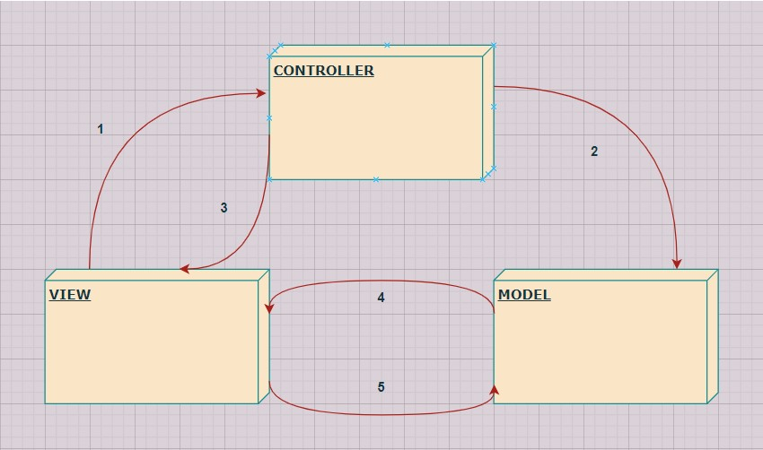

# Chapter 12 MVC Pattern

---

## Feature

 

- **MODEL**
    - **옵저버 패턴**
        - 자신의 상태 변화를 연관된 객체들에게 연락함
        - 모델을 뷰와 컨트롤러로부터 완전히 독립시킬 수 있음
        - 한 모델에서 서로 다른 뷰르르 사용할 수도 있고, 심지어 여러 개의 뷰를 동시에 사용하는 것도 가능함
     
    - 모든 데이터, 상태와 Application 로직(= **데이터를 관리하고 조작하는 코드**)이 들어있음
    - 뷰와 컨트롤러에서 모델의 상태를 조작하거나 가져올 때 필요한 인터페이스를 제공

 

- **VIEW (사용자 인터페이스)**
    - **컴포지트 패턴**
        - 각 디스플레이 항목은 복합 객체(윈도우 등)나 잎(버튼)이 될 수 있음
        - 컨트롤러가 뷰에게 화면을 갱신해 달라고 요청하면, 최상위 뷰 구성 요소에게만 화면을 갱신해 달라고 얘기하면 됨
     
    - 모델을 표현하는 방법을 제공함
    - 일반적으로 화면에 표시할 때 필요한 상태와 데이터는 모델에서 직접 가져옴

 

- **CONTROLLER**
    - **전략 패턴**
        - 뷰 객체를 여러 전략을 써서 설정할 수 있음
        - 컨트롤러가 전략을 제공함
        - 뷰는 애플리케이션의 겉모습에만 신경쓰고, 인터페이스의 행동을 결정하는 일은 컨트롤러에게 맡김
        - 제어 로직을 뷰로부터 분리해서 뷰와 모델의 결합을 끊어줌
     
    - **VIEW와 CONTROLLER가 분리된 이유**
        1. VIEW 코드가 복잡해질 수 있음
        2. VIEW를 MODEL에 밀접하게 연관시키지 않아야 함
     
    - 사용자로부터 입력을 받음
    - 입력받은 내용을 해석해서 모델에게 어떤 의미가 있는지 파악한 후, 모델을 조작함
    - 디자인에 따라서 모델의 옵저버가 될 수 있음

---

### 알고리즘

1. **<u>사용자는 뷰에만 접촉할 수 있다.</u>**
    - 뷰는 모델을 보여 주는 창
    - 사용자가 뷰에서 뭔가를 하면, 뷰는 무슨 일이 일어났는지 컨트롤러에게 알려줌
    - 그러면 컨트롤러가 상황에 맞게 작업을 처리

 

2. **<u>컨트롤러가 모델에게 상태를 변경하라고 요청한다.</u>**
    - 컨트롤러는 사용자의 행동을 받아서 해석함
    - 사용자가 버튼을 클릭하면 컨트롤러는 그것이 무엇을 의미하는지 해석
    - 모델을 어떤 식으로 조작해야 하는지 결정

 

3. **<u>컨트롤러가 뷰를 변경해 달라고 요청할 수도 있다.</u>**
    - 컨트롤러가 뷰로부터 어떤 행동을 받았을 때, 행동의 결과로써

 

4. **<u>상태가 변경되면 모델이 뷰에게 그 사실을 알린다.</u>**
    - 사용자가 한 행동이나 다른 내부적인 변화 등으로 모델에서 뭔가가 바뀌면, 모델은 뷰에게 상태가 변경되었다고 알림

 

5. **<u>뷰가 모델에게 상태를 요청한다.</u>**
    - 뷰는 화면에 표시할 상태를 모델로부터 직접 가져옴
    - 컨트롤러가 뷰에게 뭔가를 바꾸라고 요청 했을 때

---

## Usecase

- **웹 프레임워크**
    - Spring Web MVC, Django, ASP.NET MVC, AngularJS, EmberJS, JavaScriptMVC, Backbone
    - 모델, 뷰, 컨트롤러를 클라이언트와 서버에 나눠서 배치
- **웹 Application**
    - **Client** 측 Application
        - Single Page Application: 모델, 뷰, 컨트롤러가 Client에 들어감
    - **Server** 측 Application
        - Thin Client: 대부분의 모델, 뷰, 컨트롤러가 모두 서버로 들어가고 브라우저는 뷰를 화면에 표시하고 컨트롤러로 입력을 받아오는 역할만 함
    - 일부 구성 요소를 Client와 Server에서 공유하는 **하이브리드** 모델