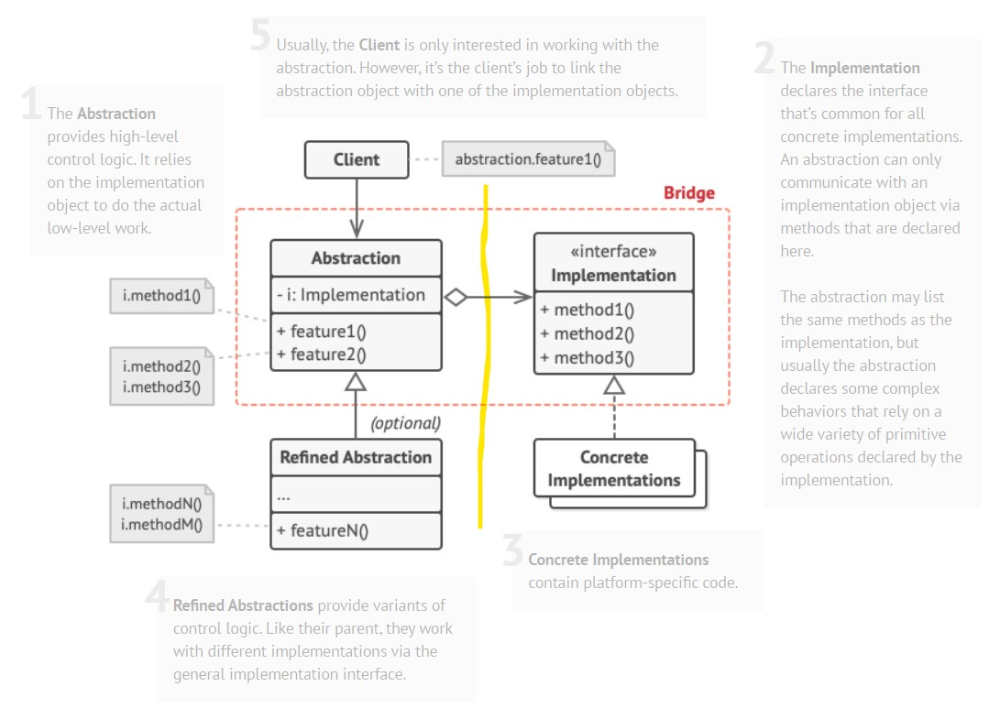
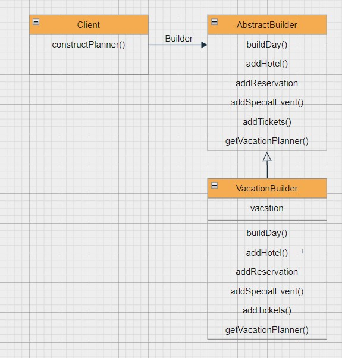

# 브리지(Bridge) 패턴

> **구현과 더불어 추상화 부분까지 변경**

### Feature

- **추상화된 부분(추상 클래스 계층 구조)** 과 **구현 부분(구현 클래스 계층 구조)** 을 서로 다른 클래스 계층구조로 분리해서 양쪽을 서로 독립적으로 변경할 수 있다.
- **두 클래스 계층 구조 사이의 관계**를 <u>**브리지(Bridge)**</u>라고 한다.
- 추상화된 부분에 들어있는 메소드는 구현 클래스에 있는 메소드를 통해서 구현된다.
- 구상 서브클래스는 구현 클래스 계층구조의 메소드가 아닌 추상  클래스의 메소드로 구현된다.

### 장점

- 구현과 인터페이스를 완전히 결합하지 않았기에 구현과 추상화 부분을 분리할 수 있다.
- 추상화된 부분과 실제 구현 부분을 독립적으로 확장할 수 있다.
- 추상화 부분을 구현한 구상 클래스가 바뀌어도 클라이언트에는 영향을 끼치지 않는다.

### 단점
- 디자인이 복잡해진다.

 

### Usecase
- 여러 플랫폼에서 사용해야 하는 그래픽스와 윈도우 처리 시스템
    - **Thread Scheduler**
- 인터페이스와 실제 구현할 부분을 서로 다른 형식으로 변경해야 할 때

---

# 빌더(Builder) 패턴

> **제품을 여러 단계로 나눠서 만들도록 제품 생산 단계를 캡슐화**

### Feature

- 계획표 작성을 **빌더**에 캡슐화해서 클라이언트가 빌더에게 계획표 구조를 만들어달라고 요청하도록 만듦 (**반복자 패턴**)
- 클라이언트는 추상 인터페이스를 사용해서 계획표를 만듦
- 구상 빌더는 실제 계획표를 만들어서 vacation이라는 복합구조에 넣음

 

### 장점
- 복합 객체 생성 과정을 캡슐화한다.
- 여러 단계와 다양한 절차를 거쳐 객체를 만들 수 있다. (**팩토리 패턴**)
- 제품의 내부 구조를 클라이언트로부터 보호할 수 있고, 클라이언트는 추상 인터페이스만 볼 수 있기 때문에 제품을 구현한 코드를 쉽게 바꿀 수 있다.

### 단점
- 팩토리 패턴을 사용할 때 보다 객체를 만들 때 클라이언트에 관해 더 많이 알아야 한다.

---

# References

- [Bridge Pattern's Class Diagram](https://refactoring.guru/design-patterns/bridge)
- [Bridge Pattern's Usecase - Thread Scheduling](https://sourcemaking.com/design_patterns/bridge)